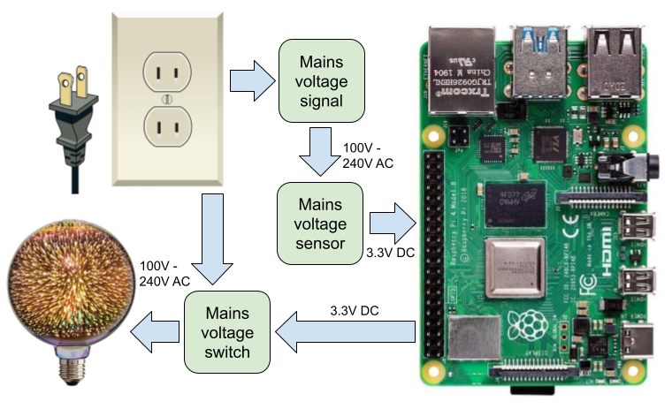

---
# Feel free to add content and custom Front Matter to this file.
# To modify the layout, see https://jekyllrb.com/docs/themes/#overriding-theme-defaults

layout: default
---

By [Paulo Castro](https://github.com/pdcastro), July 2022

> This article is hosted by GitHub Pages at: [https://pdcastro.github.io/mains-io](https://pdcastro.github.io/mains-io)  
> If you are reading the markdown source, check the hosted site for a better experience!

- [Introduction](#introduction)
- [Safety first](#safety-first)
- [Solid state relays _vs._ electromechanical relays](#solid-state-relays-vs-electromechanical-relays)
- [Choosing the right SSR](#choosing-the-right-ssr)
- [SSR application: mains voltage sensor](#ssr-application-mains-voltage-sensor)
  - [The winner](#the-winner)
- [SSR application: mains voltage switch](#ssr-application-mains-voltage-switch)
  - [Energy loss/waste as heat](#energy-losswaste-as-heat)
  - [The winner](#the-winner-1)
- [Putting it all together: DIN rails](#putting-it-all-together-din-rails)
- [Software](#software)
- [Important safety notes](#important-safety-notes)
- [Disclaimer](#disclaimer)
- [Discussion](#discussion)

## Introduction

Recently I found myself searching the web for a convenient way of using the Raspberry Pi's GPIO 
pins to detect/sense and control/switch [mains voltages (100V to 240V
AC)](https://en.wikipedia.org/wiki/Mains_electricity): simple binary on/off sensing and switching.

<figure>
  
  <figcaption>Objective: Sense a mains voltage signal (input) and control a mains voltage load (output).</figcaption>
</figure>

Some search results suggested using [current clamps](https://en.wikipedia.org/wiki/Current_clamp),
current transducers or other [current sensors](https://en.wikipedia.org/wiki/Current_sensing).
But I needed to detect a mains voltage, not current, as if detecting that a cable was energized
by the flick of a switch without any load connected to it (other than the sensor itself).

Other search results pointed to using electromechanical relays (the ones with a wire coil and
moving contacts). Yet other results pointed to optocoupler / optoisolator microchips, alongside
circuit diagrams and even PCB (Printed Circuit Board) layouts for the reader to build their own
board.

Those are valid solutions, but I was hoping to find ready-made "small boxes" that minimized exposed
circuit boards and that I could wire directly to the Raspberry Pi without additional components
like resistors or diodes.

Digging further, I came across ***solid state relays,*** or **SSRs** for short, which turned out to
be a great fit for my project. These are essentially the ready-made units I was hoping to find: the
right ones can be wired directly to the Raspberry Pi. SSRs enclose electronic circuits based on
[optocoupler](https://en.wikipedia.org/wiki/Opto-isolator) microchips, with convenient form factors
such DIN rail mounts or screw terminal sockets. There are a few different technologies of SSRs to
choose from, such as thyristor/TRIAC, MOSFET or bipolar transistors, with differences in cost and
suitability.

In this article I share the results of some experiments with a few SSRs, which hopefully will save
you some time figuring out the best solution for your own projects.

<figure id="ssr-io-experiment">
  
  <figcaption>Three of the five SSRs used in the experiments.</figcaption>
</figure>

## Safety first

<table>
<tr>
  <td style="border: none"></td>
  <td style="border: none"><b>MAINS ELECTRICITY ACCIDENTS MAY KILL YOU AND DESTROY YOUR PROPERTY.</b></td>
</tr>
</table>

This article is aimed at competent individuals with experience working with electrical
circuits, who can fully make sense of the information provided.

Please check the [important safety and disclaimer notes](#important-safety-notes) at the end
of the article.

## Solid state relays _vs._ electromechanical relays

<figure>
  
  <figcaption>Left: an electromechanical relay. Middle and right: solid state relays.</figcaption>
</figure>

Like an electromechanical relay, an SSR has two sides:

1. **Input** or **Control** or **Coil** side.
2. **Output** or **Load** or **Contact** or **Switching** side.

Also like electromechanical relays, these two sides are [galvanically
isolated](https://en.wikipedia.org/wiki/Galvanic_isolation) from each other, i.e. there is no
continuity path for an electrical current between the two sides. Electromechanical relays produce a
magnetic field in the control side to move metal contacts in the load side, while SSRs emit light
in the control side to switch semiconductor junctions on/off in the load side (built-in optocoupler
microchips).

Despite this physical difference, SSR datasheets often use the terms "coil" and "contact" to refer
to the two sides of an SSR as well, drawing a clear parallel with electromechanical relays.

Some pros and cons of SSRs compared to electromagnetic relays:

_Pros of SSRs_

- Higher switching frequency (typically).
- Less noise, avoiding the sometimes loud click-clack sound of mechanical relays.
- No need for external driver and protection circuits when connected to computing devices like the
  Raspberry Pi, Arduino, PLCs, or microcontrollers. Typically, an electromechanical relay's coil
  cannot be directly connected to the Raspberry Pi's GPIO pins because:
  1. The coil produces a [transient spike voltage when switched
     off](https://en.wikipedia.org/wiki/Flyback_diode) that may eventually damage the Raspberry Pi.
  2. It may draw more current than the maximum of 16mA that the Pi's GPIO pins can provide.
- No wear due to moving contact sparks or metal oxidation, with potentially longer lifetime.
- Lower ***minimum*** voltage and current ratings of load-side contacts, especially in applications
  where the relay is used for sensing mains voltages (very low power loads and high control
  voltages). As the load-side contacts of an electromechanical relay [wear over
  time](https://en.wikipedia.org/wiki/Contact_protection), they gradually suffer from poor
  connections (high resistance), with greater impact on lower voltages.

For an example of the last point, the datasheet of the popular [Relpol RM84 series of miniature
relays](https://www.relpol.pl/en/content/download/13766/168095/file/e_RM84.pdf) specifies:

> _Min. switching voltage:_ **5V** (AgNi), **5V** (AgNi/Au hard gold plating), **10V** (AgSnO2)  
> _Min. switching current:_ **5mA** (AgNi), **2mA** (AgNi/Au hard gold plating), **10mA** (AgSnO2)

The Raspberry Pi's GPIO pins use 3.3V and internal 50KΩ pull-down and pull-up resistors that draw
only 0.07mA, thus meeting neither the voltage nor the current requirements above. I had a hard time
trying to find electromechanical relays with a coil rated for mains voltages and better (lower)
minimum load-side contact voltage and current ratings, while suitable SSRs were easier to find.

_Cons of SSRs_

- In some cases, higher cost.
- The load side of an SSR suffers from a small leak current when the SSR is **turned off,** for
  example up to 1mA for some TRIAC SSRs up to 10μA for some MOSFET SSRs. In this sense, the load is
  never ***fully*** switched off.
  - As a result, touching the load contacts may produce an electric shock even when it appears to
    be turned off, which may be a safety consideration.
- For the same reason, a small energy waste takes place in the load side even while the SSR is
  turned off. Check the results of my experiments later in the article.
- When the control side is rated for mains voltages, some poorly designed SSRs like the IDEC
  RV8S-L-D48-A240 (not recommended) waste energy as heat in the _control side_ even when no load is
  connected, getting very hot to the touch after a few minutes in the 'on' state. See experiment
  notes below for more details. Note that this is _not_ a fundamental limitation of SSRs but rather
  a poor choice of internal components by some manufacturers. If the SSR was implemented with a
  high-gain optocoupler like the Broadcom HCPL-4701, it could consume 100x less power (e.g. 0.02W
  _vs._ 2W) and run cooler. Some SSR manufacturers simply need to step up their game!

## Choosing the right SSR

The load side of an SSR consists of semiconductors that come in a few flavours to choose from:

<table>
<tr>
  <th>SSR load-side semiconductor</th>
  <th>Load type</th>
  <th>Off-state leak current</th>
  <th>Cost</th>
</tr>
<tr>
  <td>Thyristor / TRIAC</td>
  <td>AC (alternate current)</td>
  <td>Higher (e.g. 1mA)</td>
  <td>Lower</td>
</tr>
<tr>
  <td>Bipolar junction transistor (BJT)</td>
  <td>DC (direct current)</td>
  <td>Lower (e.g. 10μA)</td>
  <td>Lower</td>
</tr>
<tr>
  <td>MOSFET transistor</td>
  <td>Both AC and DC</td>
  <td>Lower (e.g. 10μA)</td>
  <td>Higher</td>
</tr>
</table>

<figure>
  
  <figcaption>Schematic symbols of SSRs of different technologies.</figcaption>
</figure>

The ability to handle AC or DC loads is a clear-cut difference. A more subtle distinction is the
off-state leak current that, as I found out, may have side effects beyond a small energy waste,
such as humming noises or light bulb flashing as described in the experiment results below.

## SSR application: mains voltage sensor

To detect mains voltages (on/off binary sensor), the idea is to connect the control side of an SSR
to the mains voltage signal to be detected, as shown in the figure below. The load side is
connected to two pins of the Raspberry Pi header: 3.3V supply, and a GPIO pin configured by
software as _input_ with an internal pull down resistor (internal to the Raspberry Pi).

<figure>
  
  <figcaption>Mains voltage sensor connections using a suitable BJT SSR.</figcaption>
</figure>

In this application, the SSR control side should be rated for mains voltages (e.g. 240V AC, rms),
and the load side rated for low DC voltages including 3.3V DC (typically a range such as 3V DC to
24V DC). The SSR's load side technology will typically be a MOSFET or bipolar junction transistor
(BJT). The voltage drop on the transistor will typically be lower than 1V. The Raspberry Pi
interprets voltages higher than 1.8V (ideally 3.3V) as logical 1, and lower than 1.8V (ideally 0V)
as logical 0. If the voltage drop was as high as 1V, it should still be OK as 3.3V - 1V = 2.3V =
logical 1.

For my mains voltage sensing experiments, I sourced two SSR units: the [IDEC
RV8S-L-D48-A240](assets/pdf/IDEC%20SSR%20RV8S-L-D48-A240.pdf) from
[Digikey](https://www.digikey.co.uk/en/products/detail/idec/RV8S-L-D48-A240/8345049) and the [Wago
857-708](assets/pdf/Wago%20SSR%20857-708.pdf) from
[BPX](https://www.bpx.co.uk/store/product/857708). Both are based on a bipolar transistor on the
load side that can be wired directly to the header pins of a Raspberry Pi, both have DIN rail
sockets and benefit from an indicator LED on the control side. See photos in the
[Introduction](#introduction) and [Putting it all together](#putting-it-all-together-din-rails)
sections.

> **⚠ Attention!**  
> The datasheets of both SSRs specify a maximum load-side current of 100mA. Even at low voltages,
> **either the SSRs or the Raspberry Pi could get damaged** if wired incorrectly, for example if
> the load side was wired to 0V and 5V pins which would effectively mean a short circuit that could
> draw more than 100mA. If wired correctly to two GPIO pins, **a software bug could still cause a
> short circuit** if the two GPIO pins were configured as ***outputs,*** one pin at 0V and the
> other at 3.3V. In this case, however, I expect that the Raspberry Pi would supply a maximum
> current of around 16mA (based on some web search results — not tested), which would not damage
> the SSR but could possibly damage the Raspberry Pi if this maximum current was drawn for an
> extended period of time.

The table below gathers some current and voltage measurements with a digital multimeter.

<section>
<table>
<tr>
  <th>Parameter</th>
  <th>Load (3.3V DC)</th>
  <th>IDEC RV8S-L-D48-A240</th>
  <th>Wago 857-708</th>
</tr>
<tr>
  <td>Control/coil current at 240V rms, 50Hz (lower is better)</td>
  <td>Any</td>
  <td>8.5mA rms</td>
  <td>3.5mA rms</td>
</tr>
<tr>
  <td>Control/coil power consumption at 240V rms, 50Hz (lower is better)</td>
  <td>Any</td>
  <td>2W</td>
  <td>0.8W</td>
</tr>
<tr>
  <td>On-state* voltage drop, load side (lower is better)</td>
  <td>47KΩ resistor** (0.07mA&nbsp;DC)</td>
  <td>0.21V DC</td>
  <td>0.12V DC</td>
</tr>
<tr>
  <td>On-state* voltage drop, load side (lower is better)</td>
  <td>100Ω resistor (25mA&nbsp;DC)</td>
  <td>0.79V DC</td>
  <td>0.72V DC</td>
</tr>
</table>

<footer>
<small><i>* "On state" means that the SSR was turned on with mains voltage applied to the control side. The
voltage drop is on the relay terminals, load side.</i></small> 
<small><i>** A 47KΩ resistor load simulates the Raspberry Pi's internal 50KΩ pull-down / pull-up resistor
(configurable by software).</i></small>
</footer>

</section>

### The winner

The Wago unit was a clear winner in all metrics, but especially for running less hot. The 2W
consumed by the _control side_ of the IDEC unit (even when no load is connected) results in the
unit getting very hot to the touch after a few minutes in the 'on' state: Holding it at the warmest
spot for more than a few seconds would burn my fingers. The heat comes from an internal voltage
drop resistor. The Wago unit wastes "only" 0.8W by using high efficiency LEDs that draw less
current; it got warm to the touch, but not hot like the IDEC unit and OK to hold without burning
one's fingers. Even better designs would be possible if the SSR internally used a high-gain
optocoupler microchip like the Broadcom HCPL-4701 that requires only 40μA in the control side. This
would allow the SSR to consume e.g. 0.02W instead of 2W or 0.8W, and run cooler.

## SSR application: mains voltage switch

This is the more common use of relays: a low-voltage control side connected to the Raspberry Pi,
and the load side connected to a mains-voltage AC load (e.g. light bulb, electric motor, room
heater, etc.). The control side is connected to two pins from the Raspberry Pi header: GND, and a
GPIO pin configured as output, producing 3.3V as logic 1 and 0V as logic 0. The connections are
illustrated in the figures below.

<figure>
  
  <figcaption>
    Circuit for a TRIAC SSR with a built-in control-side LED driver rated for 3.3V DC,
    such as the LinkFreely TRA23D10 or the LDG MRA-23D2 SSRs.
  </figcaption>
</figure>

<figure>
  
  <figcaption>
    Circuit for a generic MOSFET SSR with a built-in control-side LED driver rated for 3.3V DC.
  </figcaption>
</figure>

<figure>
  
  <figcaption>Circuit for the CPC1984Y MOSFET SSR with an external 330Ω resistor.</figcaption>
</figure>

For my mains voltage switching experiments, I sourced three SSR units: the [LinkFreely
TRA23D10](assets/pdf/LinkFreely%20TRA23D10%20AliExpress.pdf) and the [LDG
MRA-23D2](assets/pdf/LDG%20MRA-23D2%20AliExpress.pdf) from AliExpress, both cheap-ish TRIAC-based
units in DIN rail mounts, and the [IXYS CPC1984Y](assets/pdf/IXYS%20CPC1984Y%20MOSFET%20SSR.pdf)
MOSFET SSR in a 4-pin SIP package from Digikey. See photos in the [Introduction](#introduction) and
[Putting it all together](#putting-it-all-together-din-rails) sections.

The first two units are supplied in DIN rail packages with screw terminals and do not require
external components (resistor). The CPC1984Y requires an external resistor and assembling in a PCB
or perfboard. As such, it does not meet my initial requirement of being a _"ready-made small box,
without an exposed PCB, that could be wired directly to the Raspberry Pi without additional
components"._ If a PCB is needed, one might as well add a driver circuit for the coil of an
electromechanical relay instead of using an SSR (depending on the application). Indeed I only
included the CPC1984Y in my experiments when I realized that the other SSRs I had were not able to
cope with a mains-voltage LED light bulb load as explained below, and I was curious whether a
low-leak-current MOSFET SSR would solve the problem. Sadly, I could not find any MOSFET SSR model
in a more convenient form factor, at least not one under USD $30 and preferably with a DIN rail
socket. If you find one, let me know!

The table below gathers some current and voltage measurements with a digital multimeter.

<section>
<table>
<tr>
  <th>Parameter</th>
  <th>Load (240V rms)</th>
  <th>LinkFreely TRA23D10 (TRIAC)</th>
  <th>LDG MRA-23D2 (TRIAC)</th>
  <th>IXYS CPC1984Y (MOSFET)</th>
</tr>
<tr>
  <td>Control/coil current at 3.3V DC (lower is better)</td>
  <td>Any</td>
  <td>6.1mA DC</td>
  <td>6.6mA DC</td>
  <td>5.6mA DC (external 330Ω resistor)</td>
</tr>
<tr>
  <td>Control/coil current at 5.2V DC (lower is better)</td>
  <td>Any</td>
  <td>8.5mA DC</td>
  <td>9.7mA DC</td>
  <td>8.0mA DC (external 470Ω resistor)</td>
</tr>
<tr>
  <td rowspan="4">On-state* voltage drop, load side (lower is better)</td>
  <td>3W mains-voltage LED light bulb</td>
  <td>1.17V rms</td>
  <td>1.06V rms</td>
  <td>0.04V rms</td>
</tr>
<tr>
  <!-- On-state* voltage drop, load side (lower is better) -->
  <td>42W halogen light bulb</td>
  <td>0.99V rms</td>
  <td>0.93V rms</td>
  <td>0.09V rms</td>
</tr>
<tr>
  <!-- On-state* voltage drop, load side (lower is better) -->
  <td>60W water pump motor</td>
  <td>1.00V rms</td>
  <td>0.93V rms</td>
  <td>0.11V rms</td>
</tr>
<tr>
  <!-- On-state* voltage drop, load side (lower is better) -->
  <td>1.5KW resistive heater</td>
  <td>1.05V rms</td>
  <td>-</td>
  <td>-</td>
</tr>
<tr>
  <td rowspan="4">Off-state** leak current, load side (lower is better)</td>
  <td>3W mains-voltage LED light bulb</td>
  <td>0.66mA rms</td>
  <td>0.92mA rms</td>
  <td>0.01mA rms</td>
</tr>
<tr>
  <!-- Off-state* leak current, load side (lower is better) -->
  <td>42W halogen light bulb</td>
  <td>0.69mA rms</td>
  <td>1.01mA rms</td>
  <td>0.01mA rms</td>
</tr>
<tr>
  <!-- Off-state* leak current, load side (lower is better) -->
  <td>60W water pump motor</td>
  <td>0.69mA rms</td>
  <td>1.01mA rms</td>
  <td>0.01mA rms</td>
</tr>
<tr>
  <!-- Off-state* leak current, load side (lower is better) -->
  <td>1.5KW resistive heater</td>
  <td>0.69mA rms</td>
  <td>-</td>
  <td>-</td>
</tr>
</table>

<footer>
<small><i>* "On state" means that the SSR was turned on with 3.3V DC applied to the control side. The
voltage drop is on the relay terminals, load side.</i></small> 
<small><i>** "Off state" means that the SSR was turned off by having the control side disconnected.</i></small>
</footer>

</section>

The most interesting finding was a misbehavior when the load was a 3W mains-voltage LED light bulb
(Edison screw cap), with a built-in LED driver. **When the SSR was turned off (control side
disconnected), the TRA23D10 and the MRA-23D2 TRIAC SSRs caused the light bulb to flash at around
2Hz rather than properly turn off,** as shown in the short video below. When the SSRs were turned
on, the light bulb correctly shone at full brightness. I tested two further mains-voltage LED light
bulbs that also misbehaved in the off state, though rather than flashing, they would either produce
a noticeable hum noise, or shine at low brightness. Flashing, humming, or low shining — it is not
what you want when the light bulb is supposed to be turned off!

<figure style="text-align: center">
  <video width="320" height="320" src="assets/img/flashing-light-bulb.m4v" controls loop>
    Sorry, your browser doesn't support embedded videos.
  </video>
  <figcaption>Video: Some SSRs cause the LED light bulb to flash when it should be turned off.</figcaption>
</figure>

I believe the cause is the relatively high off-state leak current of the TRA23D10 and the MRA-23D2
SSRs, that affects the built-in driver circuit of the mains-voltage LED light bulb. At least in the
case where the light bulb flashed, the LED driver probably contained a rectifying bridge that
charged a capacitor. A leak current nearing 1mA would be sufficient to charge that capacitor in
less than a second, at which point the light bulb emitted a flash that discharged the capacitor and
restarted the cycle. This is just a theory though.

**This misbehavior did not happen with the IXYS CPC1984Y MOSFET SSR.** I believe this is because
the leak current was about 100x lower than the TRIAC models (1mA _vs._ 0.01mA). Such a low current
would be comparable to the self-discharge current of the LED driver capacitor, not allowing the
capacitor to charge to the point of causing flashing or noticeable humming or shining.

Whatever the explanation, the observed fact is that the selected MOSFET SSR did a good practical
job of turning on and off all of the tested load types, while the selected TRIAC SSRs were not able
to handle the mains-voltage LED light bulb.

All three SSRs did a good job with the other load types (halogen bulb, pump motor, resistive
heater) in either 'on' or 'off' states: no noticeable humming or shining.

### Energy loss/waste as heat

Regarding energy loss / waste heat, the following table provides some calculations. The on-state
heat loss in the SSR, in watts, was calculated by multiplying the the voltage drop at the SSR
terminals (given in the previous table) by the load current. The load current, in turn, was
calculated as the load power divided by 240V rms (my mains voltage). In the off state, we are
interested in the sum of dissipated power over both the load and the SSR. Therefore, it was
calculated by multiplying the SSR leak current (given in the previous table) by the mains voltage
of 240V rms.

<section>
<table>
<tr>
  <th width="30%">Parameter</th>
  <th>Load (240V rms)</th>
  <th>LinkFreely TRA23D10 (TRIAC)</th>
  <th>LDG MRA-23D2 (TRIAC)</th>
  <th>IXYS CPC1984Y (MOSFET)</th>
</tr>
<tr>
  <td rowspan="4">
    On-state* heat loss in the SSR, in watts. In brackets,
    relative value as a percentage of the load power.
  </td>
  <td>3W mains-voltage LED light bulb</td>
  <td>0.01W (0.49%)</td>
  <td>0.01W (0.44%)</td>
  <td>0.001W (0.02%)</td>
</tr>
<tr>
  <!-- On-state* voltage drop, load side (lower is better) -->
  <td>42W halogen light bulb</td>
  <td>0.17W (0.41%)</td>
  <td>0.16W (0.39%)</td>
  <td>0.02W (0.04%)</td>
</tr>
<tr>
  <!-- On-state* voltage drop, load side (lower is better) -->
  <td>60W water pump motor</td>
  <td>0.25W (0.42%)</td>
  <td>0.23W (0.39%)</td>
  <td>0.03W (0.05%)</td>
</tr>
<tr>
  <!-- On-state* voltage drop, load side (lower is better) -->
  <td>1.5KW resistive heater</td>
  <td><b>6.5W</b> (0.44%)</td>
  <td>-</td>
  <td>-</td>
</tr>
<tr>
  <td rowspan="4">
    Total off-state** heat loss over the SSR and the load, in watts.
    In brackets, relative value as a percentage of the load power.
  </td>
  <td>3W mains-voltage LED light bulb</td>
  <td>0.16W <b>(5.3%)</b></td>
  <td>0.22W <b>(7.4%)</b></td>
  <td>0.002W (0.08%)</td>
</tr>
<tr>
  <!-- Off-state* leak current, load side (lower is better) -->
  <td>42W halogen light bulb</td>
  <td>0.17W (0.39%)</td>
  <td>0.24W (0.58%)</td>
  <td>0.002W (0.006%)</td>
</tr>
<tr>
  <!-- Off-state* leak current, load side (lower is better) -->
  <td>60W water pump motor</td>
  <td>0.17W (0.28%)</td>
  <td>0.24W (0.40%)</td>
  <td>0.002W (0.004%)</td>
</tr>
<tr>
  <!-- Off-state* leak current, load side (lower is better) -->
  <td>1.5KW resistive heater</td>
  <td>0.17W (0.01%)</td>
  <td>-</td>
  <td>-</td>
</tr>
</table>

<footer>
<small><i>* "On state" means that the SSR was turned on with 3.3V DC applied to the control side.</i></small> 
<small><i>** "Off state" means that the SSR was turned off by having the control side disconnected.</i></small>
</footer>

</section>

If the mains voltage was, say, 120V rms instead of 240V rms and the loads were of the same power,
the load current would double and the on-state heat losses would double as well (both absolute and
relative). Indeed, the current for a 1.5KW heater would double from 6.25A to 12.5A and would exceed
the 10A maximum rating of the TRA23D10. (By the way, even at 6.25A, one should consider SSR models
with good heat dissipators for safer operation.) In the off state, I am not sure if the leak
currents would remain the same but at least I expect they would not be any higher. If they remained
the same, the off-state losses would halve (both absolute and relative) compared to the values in
the table above.

### The winner

The IXYS CPC1984Y MOSFET SSR was a winner across all measured parameters, however the comparison is
not quite fair because:

* As mentioned earlier, it requires assembling in a PCB or perfboard with an external resistor, so
  it does not meet the initial requirements that I used to select the other SSRs. It is a microchip
  rather than a _"ready-made small box that can be wired directly to the Raspberry Pi."_

* It is rated for 1A loads rather than the 2A or 10A ratings of the other SSRs. There are of course
  MOSFET SSRs rated for higher current loads, though at a higher cost.

Another interesting observation about the IXYS CPC1984Y MOSFET SSR is that the measured leak
current of 10μA (0.01mA), although quite low, is actually 10 times higher than the datasheet
specification, which is 1μA _maximum._ I measured it both directly through a multimeter, and
indirectly through the voltage drop on a 100KΩ resistor used as the load: 1.1V / 100KΩ = 11μA rms.
Whether 10μA or 11μA, it is clearly more than the 1μA promised in the CPC1984Y datasheet for
temperatures of up to 85ºC (185ºF) (the device was actually cooler than my finger). Maybe I was
unlucky and got a defective unit, or somehow managed to damage it, but it is also an odd
coincidence that the datasheets of comparable units from other manufacturers (comparable in shape,
load ratings and price), such as the [Panasonic PhotoMOS Power
series](assets/pdf/Panasonic-PhotoMOS-Power-Catalog.pdf), specify leak currents of 10μA — just what
I measured.

## Putting it all together: DIN rails

Connecting the Raspberry Pi to relays, breakout boards or custom PCBs can result in a fair amount
or wiring. When mains voltages are involved, it is especially important that components are firmly
attached to avoid wires being pulled out. A final assembly might involve screwing or gluing
components to a plastic enclosure, but while testing and prototyping, a more flexible solution is
beneficial. I have recently rediscovered the good old [DIN
rail](https://en.wikipedia.org/wiki/DIN_rail) and cheap [plastic brackets on
AliExpress](https://www.aliexpress.com/wholesale?SearchText=din+rail+brackets) that I successfully
used to attach two common Raspberry Pi cases to the rail — see photos. There are also Pi enclosures
specifically designed for DIN rails, but I found them to be on the pricey side. Rails can be
purchased pre-cut to severals lengths from 10cm to 1m, made of steel or aluminum, and many come
with pre-drilled holes that make it easier to attach the rails themselves to a plastic enclosure,
wooden panel or the walls of a wiring cabinet. Most of the SSRs mentioned in this article come with
DIN rail mounts. Power sockets, fuses, RCD / RCBO devices, switches, and so on can also be found
with DIN rail mounts. There are also "plug-in screw terminal blocks", [like
these](https://www.aliexpress.com/wholesale?SearchText=2EDG-UKR-5.08mm), that have two detachable
sides (socket and plug) that allow a whole project mounted on a DIN rail to be moved between a
workbench and a field location during prototyping.

<figure>
  
  <figcaption>
    A prototype project assembled on a DIN rail, including plug-in screw terminal blocks
    (green, left), a Raspberry Pi and several relays.
  </figcaption>
</figure>

<figure>
  
  <figcaption>DIN rail brackets screwed to a common Pi 4 case.</figcaption>
</figure>

<figure>
  
  <figcaption>DIN rail brackets screwed to a common Pi 2 case.</figcaption>
</figure>

## Software

While this article focuses on hardware, I put together some lines of code to monitor a GPIO input
pin and copy its state to an output pin, in order to fully test the SSR integration with a
Raspberry Pi. An SSR operating as a mains voltage sensor can be connected to the input pin, and an
SSR operating as a mains voltage switch can be connected to the output pin, as shown in a
[photo](#ssr-io-experiment) in the Introduction section. More details can be found in the GitHub
repo's [README](https://github.com/pdcastro/mains-io#readme) document.

## Important safety notes

* Accidentally touching mains voltage connections may hurt you or kill you — tissue burn, muscle
  damage, dislocated joints, heart stop, inability to breathe. Once you've touched it, you may not
  be able to "let go", whether because of a muscle spasm or because of disruption in the electric
  signals between your brain and your muscles. Anyone else touching you in an attempt to rescue you
  may actually suffer the same fate as you.

* **Accordingly, when working on a project involving mains voltages, ensure that the mains supply
  is protected by an [RCD or RCBO device](https://en.wikipedia.org/wiki/Residual-current_device).
  If the supply is not protected in the [distribution
  board](https://en.wikipedia.org/wiki/Distribution_board), at least get yourself a standalone
  [RCD plug](https://www.google.com/search?q=rcd+plug).**

* Connecting the header pins of a Raspberry Pi to the mains supply will destroy it and anything
  else connected to it, such as your PC. In particular, simply reducing the voltage through series
  resistors and capacitors is not enough: [Galvanic
  isolation](https://en.wikipedia.org/wiki/Galvanic_isolation) is required (e.g. relays,
  optocouplers, magnetic transformers).

* Add a low-current fuse to your project's mains-voltage wiring when testing or prototyping. Glass
  fuses of 100mA or higher are widely available and cheap. Inline sockets can be convenient, with
  pre-wired leads at both ends. Fuses won't protect you from an electric shock, but they may help
  against wire overheating or some scenarios of component explosions in case of connection or
  design mistakes, or handling mishaps.

* Specifically in relation to solid state relays, as discussed in the article, keep in mind that
  the load side leak current means that the load is never ***fully*** switched off. This means that
  you may get an electric shock if you touch the load's terminals even if the SSR is in the off
  state (i.e. no voltage applied to the control side).

* When designing a circuit, consider what would happen if any one component was to fail. Assume the
  failure may take the form of an open circuit, a short circuit, or a significant shift in the
  component's value over time. Capacitors are notoriously prone to failure. The consequence may be
  wires overheating and electronic components exploding. Adding a suitable fuse may prevent the
  worst outcomes in overcurrent situations.

* Be aware of the peak and peak-to-peak values of your mains mains voltage and the tolerance range.
  For example, in Europe and the UK:
  * Nominal range: **230V** +10% -6%, i.e. from **216V** to **253V** rms. These are RMS (root mean
    square) values.
  * Peak value: 253 * √2 = **358V**
  * Peak-to-peak value: 358 * 2 = **716V**
  * The peak value may be needed when selecting some electronic components. The component's
    datasheet should clarify whether a voltage rating is RMS or peak. If the datasheet fails to
    clarify, usually the peak value is used for ratings related to voltage isolation or insulation
    (e.g. capacitor dielectric), and the RMS value for ratings related to heat dissipation.
  * The peak-to-peak value should be used when selecting an oscilloscope probe to visualize the
    waveform. For 716V peak to peak, this typically means a 100x high-voltage probe. Use
    battery-powered portable scopes to avoid short circuits through the probe's ground lead.
  * It is common engineering practice to overprovision, e.g. select a component rated for 800V
    rather than 400V if the normal operation may reach 358V, for two reasons: 1. A datasheet's
    "absolute maximum rating" is _a value at which the component is **under stress**_ that may lead
    to shorter life, and 2. The mains supply may suffer voltage fluctuations outside the nominal
    value range, for example in the event of brownouts or blackouts (lightning storms, generator
    instability).

* Don't forget that wires/cables and resistors have maximum voltage ratings as well. In low-voltage
  circuit design, attention is mainly given to a resistor's power rating in watts and a wire's
  thickness in mm2 or AWG, which are related to the current (amps) flowing through them.
  Most ordinary (cheap, small) resistors are specified to 200V peak which is insufficient for mains
  voltages of 358V peak as mentioned above. The issue with resistors at higher voltages is not
  temperature but rather, I understand, [coating
  creepage](https://en.wikipedia.org/?title=Creepage&redirect=no). For wires or cables, the issue
  is the thickness of the insulation material, rather than the thickness of the conductor.

* If designing a PCB or perfboard exposed to mains voltages, pay attention to the requirements
  of [creepage and clearance](http://www.creepage.com): minimum distances between
  tracks, component pins and exposed wires.

## Disclaimer

<em><b>The information in this article is provided without warranty of any kind, express or implied,
including but not limited to the warranties of merchantability, fitness for a particular purpose
and noninfringement. In no event shall the author be liable for any claim, damages or other
liability, whether in an action of contract, tort or otherwise, arising from, out of or in
connection with the information in this article or the use or other dealings in it.</b></em>

## Discussion

Leave your comments below, or head straight to the repo's [Discussions](https://github.com/pdcastro/mains-io/discussions/) section.

If you liked this article, give the source repo a star on GitHub!  
<a class="github-button" href="https://github.com/pdcastro/mains-io" data-color-scheme="no-preference: dark; light: dark; dark: dark;" data-icon="octicon-star" data-size="large" aria-label="Star pdcastro/mains-io on GitHub">Star</a>

